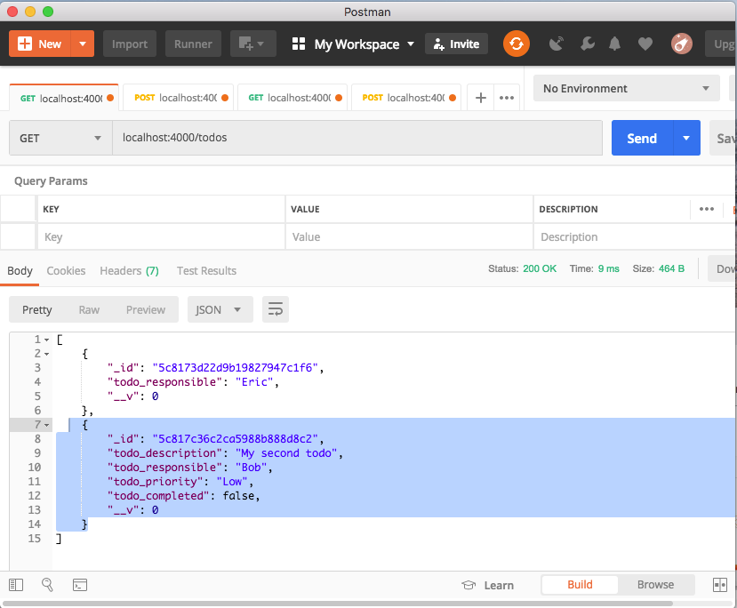
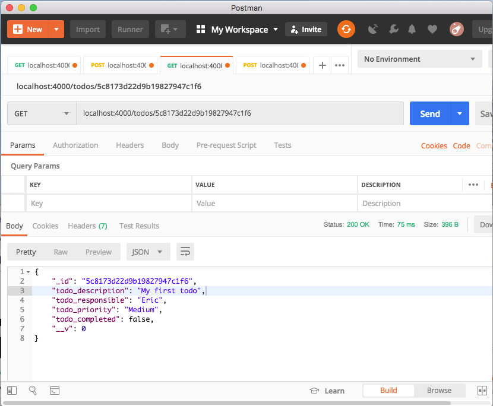
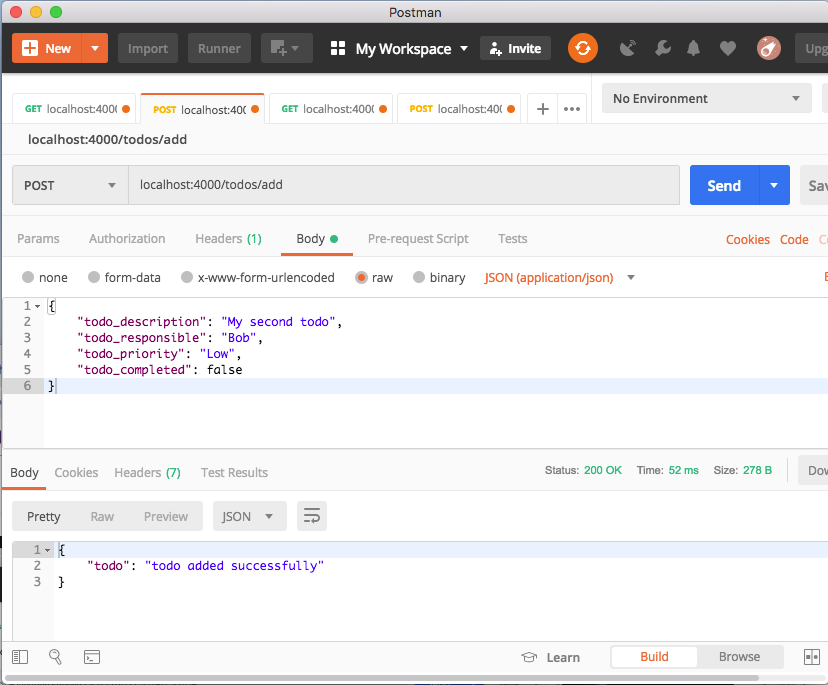
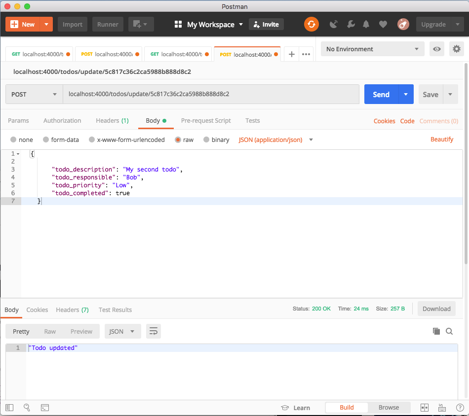

# Steps to MERN-Stack-App
# Front-End Set up
## 1. Create the React App and a css library (optional)
### Install
* npx create-react-app your-app-directory: *Installs React and creates the app directory*
* npm install bootstrap: *Installs bootstrap for use with React*
### Import into app.js

* import "bootstrap/dist/css/bootstrap.min.css";

### Other commands:
* yarn start: *Starts the development server*

* yarn build: *Bundles the app into static files for production.*

* yarn test: *Starts the test runner*

* yarn eject: *Removes this tool and copies build dependencies, configuration files
and scripts into the app directory. If you do this, you can’t go back!*

* cd your-app-name: *Navigate to the app directory*

* yarn start *Start the app*

## 2. Set up React Router
### Install
* npm install react-router-dom: *Installs React Router*
### Import into app.js
* import { BrowserRouter as Router, Route, Link } from "react-router-dom":

## 3. Set Up Routes In App.js
### Bleow is an example
* < Route path="/" exact component={TodosList} />
* < Route path="/edit/:id" component={EditTodo} />
* < Route path="/create" component={CreateTodo} />

## 4. Create Components for Your Routes
* Create a new folder called components
* Create .js files for each route

*Example*

create-todo-component.js

edit-todo-component.js

list-todo-component.js

## 5. For each Component 
### import React, { Component } from "react";
### Create class to extend component (if needed) and...
- Create a **Constructor** to pass props
    - start with: 
        - "super(props)"
    - Create states:
        -  this.state {
                property: value
            }
    - Create event handler methods. *Make them equal to an arrow function so you don't have to bind them to "this".*
        - for example:
        ChangeMyMethod = (e) => {
            this.setState ({property: e.target.value})
        }
### Create what gets rendered
- render() {
    return( 
        for example: a form
    )
}

# Back -End Set up
## 6. Create a folder for back-end development in the root folder of the app, not in the src (front-end) folder

### In Terminal
- npm init -y: *Creates package.json*
- Install dependencies: 
    - npm install express body-parser cors mongoose
        - express: *framework that simplifies the creation of web server*
        - body-parser: *express middle ware that parses HTTP request body*
        - cors: *express middleware that allows restricted resources be requested from another domain outside the domain from which the first resource was served*
        - mongoose: *object data modeling (ODM) library that provides a rigorous modeling environmen that allows access to a MongoDB in an object oriented wqy*
- Install Nodemon globally on your machine if not already:
    - nodemon monitors and automatically restarts server when changes occur 
    - npm install -g nodemon
## 7. Create a server.js file
- Require all the dependencies, define PORT and middleware:
    - const express = require("express");
    - const express = require("express");
    - const app = express();
    - const bodyParser = require("body-parser");
    - const cors = require("cors");
    - const PORT = 4000;
    - app.use(cors());
    - app.use(bodyParser.json());

- Set PORT to listen:
    - app.listen(PORT, function() {
        consol.log(`Listening on PORT ${PORT}`)
    });

## 8. Install MongoDB community edition (if not already installed), start MongoDB and connect/create database

- Go to link for instructions:
    - https://docs.mongodb.com/manual/administration/install-community/

- To start MogoDB open a terminal windos and type..
    - mongod
    - keep this terminal open to keep MondoDB running
- Connect to / create database:
    - Open a second terminal window and..
        - Start the MongoDB client interface to input commands by typing...
            - mongo
        - Connect / create database by typing...
            - use name-of-database: *this will connect to the db, and if it doesn't already exist, creates it first.*

## 9. Connect database to the application in server.js
- Require mongoose:
    - const mongoose = require ("mongoose");

- Connect to local port:
    - mongoose.connect("mongodb://localhost:27017/name-of-database", { useNewUrlParser: true });

- Test that connectin to db has been established:
    - connection.once("open", function(){
    console.log("MongoDB database connection established")
});

- Run the server to test the connection:
    - nodemon server.js

## 10. Define the Mongoose Schema
- Create new js file for the schema that will conatain the schema (model/structure) of the database.
- Import mongoose:
    - const mongoose = require("mongoose")
- Access Schema method from mongoose:
    - const schema = mongoose.Schema;
- Define your data structure
    - let SchemaName = new Schema({
        property: {
            type: DataType
        }
    });
- Export the schema model module:
    - module.exports = mongoose.model("ModuleName", SchemaName)
## 11. Import the schema model module into the server file and create endpoints:
- Import the model module
    - let ModuleName = require("path_to_module_file#)
- Get access to the .Router method in express to handle the endpoint routing
    - const = myRoutes = express.Router()
- You can make things easier on yourself by defining an initial path to your route const:
    - app.use("/yourPath", myRoutes)

- Create your endpoints than test them in Postmaster.
    - *Examples include:*
        - **.get route to retrieve all db items**
        
        - **.get route to retrieve a specific db item using an id**
        
        - **.post route for adding an item**
        
        - **.post route for updating an item by an id**
        

# Connect Front-End to Back-End

## 12. Install Axios to your React application and import into the component that needs to communicate with the back end.

- npm install axios
    - *Allows communication between front-end and back-end by allowing HTTP requests to the various server endpoints.*
- import axios from ("axios")

## 13. Connect to the back end so that data can be send to the server then to the database;
- Example:
    - axios.post("http://localhost:4000/todos/add", newTodo)
    .then(res => console.log(res.data));